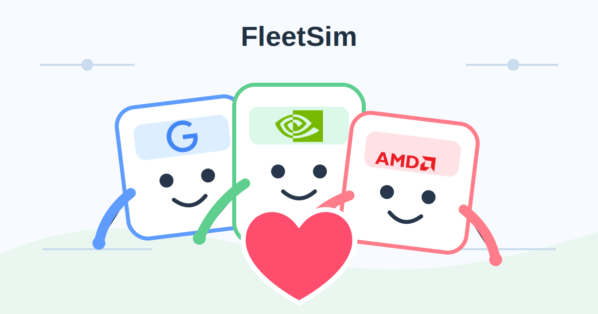

# FleetSim

FleetSim is an open-source simulator and optimizer for AI compute fleets.

The question is simple:

> Given this model and workload, what should I run, where should I run it, and what will it cost?

Large AI labs have internal systems for answering that question. They can compare hardware, kernels, quantization formats, parallelism modes, providers, prices, and SLOs before committing to a deployment. The open-source ecosystem does not have a shared version of that layer. FleetSim aims to build one.

The vision is plug-and-play: provide a model, workload, and SLO, and FleetSim returns the optimal compute fleet across NVIDIA GPUs, AMD GPUs, Google TPUs, AWS Trainium, CPUs, storage, and networking, with exact costs from actual provider data.

FleetSim should aggregate compute supply, pricing, and availability across providers, then optimize directly over the real market. Instead of manually benchmarking every deployment, users should be able to simulate the deployment space first and spend real money only on the configurations that matter.

FleetSim starts small: model extraction and kernel measurements.

## Initial Scope

FleetSim V0 focuses on two layers:

1. Models
   Architectures, tensor shapes, model formats, and weight quantization.

2. Kernel Layer
   FlashInfer, FlashAttention, Triton, CUTLASS, attention kernels, GEMM, MoE, norms, and collectives.

The first milestone is to extract model structure from real artifacts and map that structure to measurable kernel shapes.

## Measurements

FleetSim is measurement-first. The simulator should not pretend that FLOPs are enough. Runtime estimates should come from measured data whenever possible.

A measurement records:

- model architecture
- kernel name
- operation type
- tensor shape
- dtype or quantization
- hardware
- software stack
- runtime distribution

These measurements become the runtime database that powers later simulation and optimization layers.

## TODO

- Backend scheduling: waiting queues, running queues, batching, prefill/decode scheduling.
- Deployment routing: load balancing, replica routing, cache-aware routing, request placement.
- Decoding strategies: standard decoding, speculative decoding, draft models, MTP, EAGLE, n-gram speculation.
- Cache strategies: KV cache layout, KV allocation, KV reuse, prefix caching, KV eviction, KV quantization.
- Disaggregation: prefill/decode separation, KV transfer, KV connectors, KV offload tiers.
- Parallelism: tensor, pipeline, data, expert, context parallelism, replicas.
- Infrastructure: GPUs, CPUs, memory, storage, interconnects, networking, cluster topology, placement.
- Providers: cloud and bare-metal providers, pricing, regions, availability.
- Compute aggregation: available hardware, provider inventory, capacity, and price feeds.
- Workloads: synthetic workloads, measured traces, traffic models, agent steps, tool calls.
- Optimization: SLOs, latency, throughput, cost, utilization, memory limits, availability targets.
